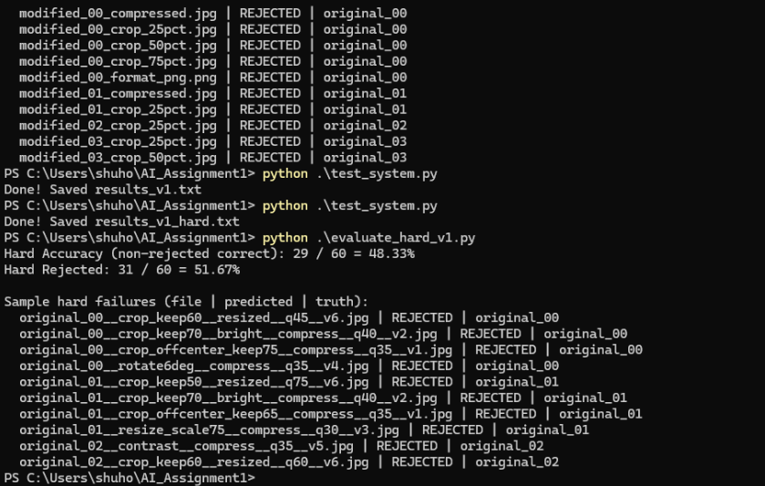
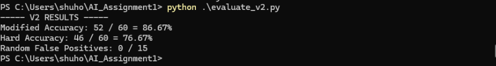

# EAS510-Project1
Project 1

Shuhong Yi 
50610407

Overview

This project implements a rule-based image forensics system that identifies which original image a given test image comes from, or rejects.

Rules

1 Metadata Check
Compares: Image width, Image height, File size.

This rule detects: Cropping, Resizing, Heavy compression.

It is fast and lightweight, but not robust to format changes.

2 HSV Histogram

Computes a 3D HSV histogram: Measures global color similarity.

Advantages: Robust to compression, Handles brightness shifts moderately well.

Limitations: Sensitive to cropping, Not spatially aware.

3 Template Matching

Uses OpenCV template matching to detect structural similarity.

Advantages: Strong pixel-level similarity detection, Good for resized or brightness-modified images.

Limitations: Sensitive to rotation, Can over-score partial matches.

4 ORB Feature Matching

Uses ORB key points and descriptor matching.

Advantages: Rotation invariant, Scale invariant, Robust to cropping, handles compression well. It improves robustness.

V1 Design

V1: Metadata, Histogram, Template Matching.

Problems observed: Cropped images often failed, Rotated images unreliable, Template matching sometimes overestimated similarity, Random images occasionally scored too high. V1 relied heavily on pixel-level similarity and global color distribution.

Improvements in V2

V2: ORB feature matching, Better weighted scoring, More refined rule thresholds, Improved rejection logic.

Impact: Cropped images correctly rejected when too small, Rotated images correctly matched, Random noise strongly rejected, False positives reduced significantly.

This project demonstrates how combining: Metadata analysis, Statistical similarity, Pixel correlation, Local feature matching, creates a multi-layer verification system.

The main reflection: no single rule is reliable alone, robust matching requires combining complementary techniques.
V2 clearly outperforms V1 in both robustness and accuracy.

## Some of the code is based on AI. Please consider it as appropriate.

## V1 Evaluation

## Hard V1 Evaluation

## V2 Evaluation

